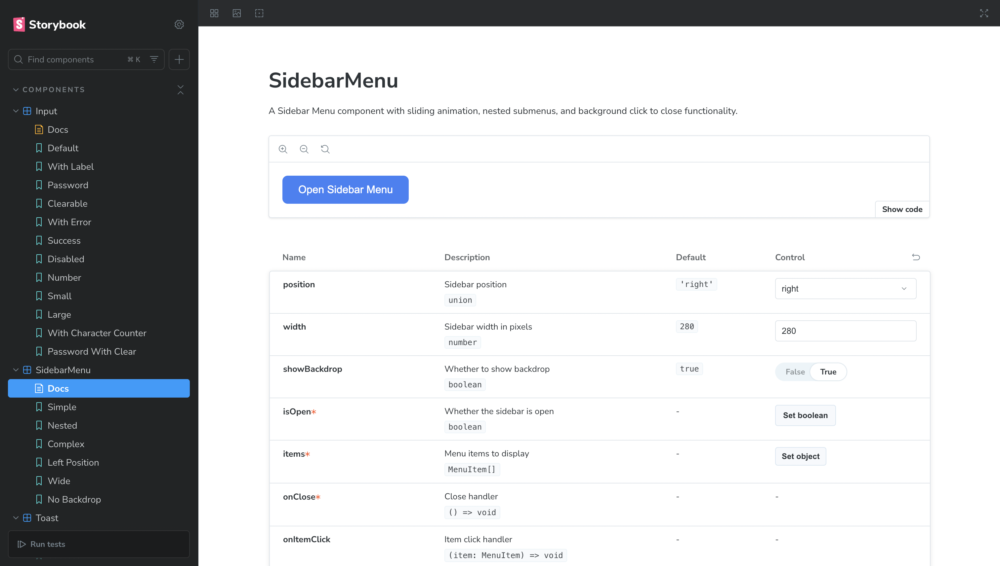
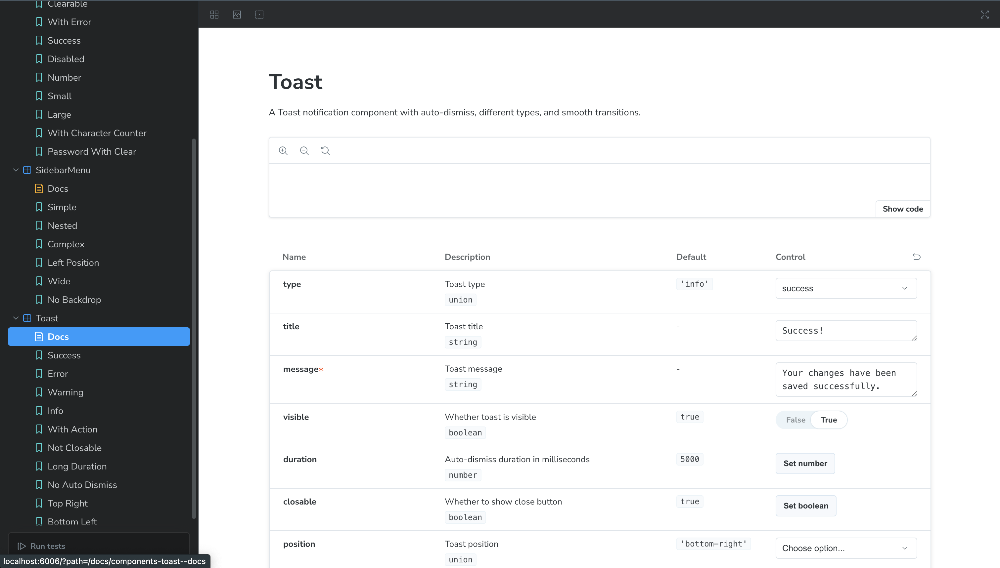
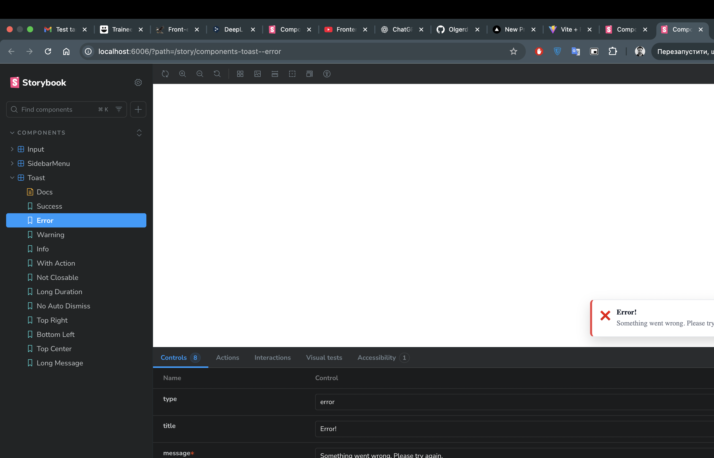
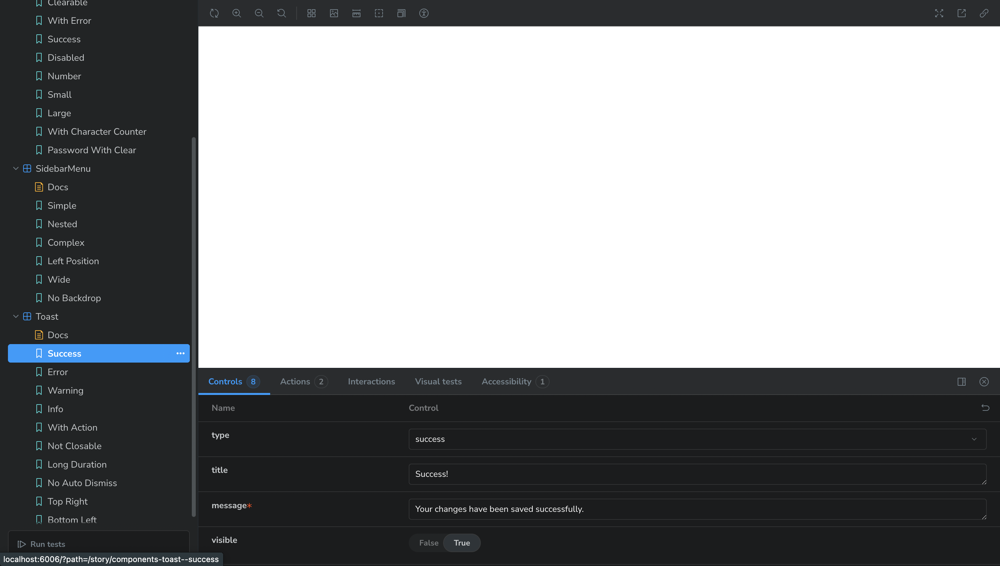
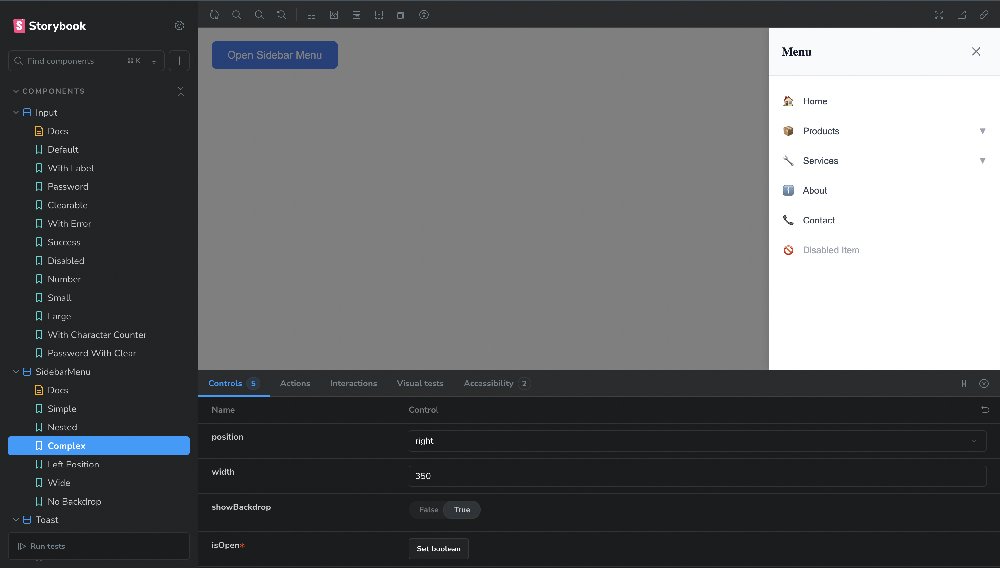
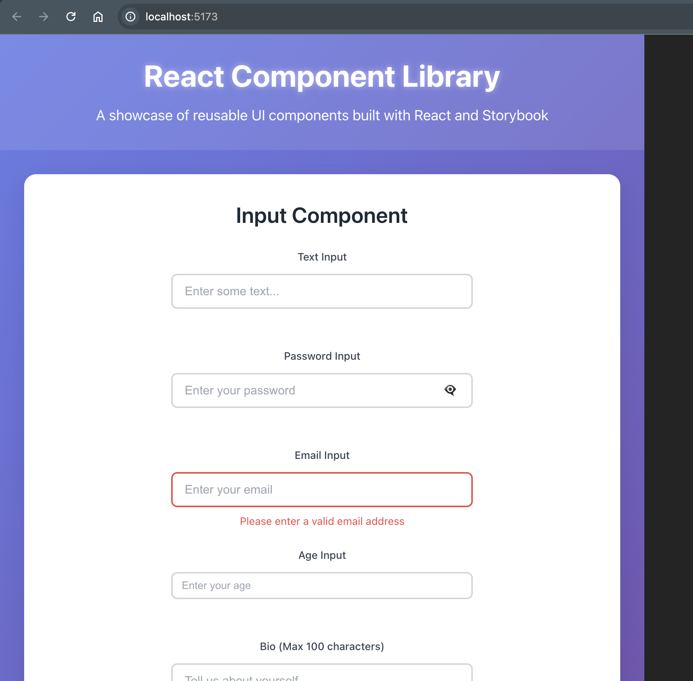

# React UI Component Library

A modern, accessible React component library built with TypeScript and Storybook. This library provides three core UI components designed for building beautiful and functional user interfaces.

## 🚀 Features

- **TypeScript Support** - Full type safety and IntelliSense
- **Storybook Integration** - Interactive component documentation and testing
- **Accessibility First** - Built with ARIA compliance and keyboard navigation
- **Responsive Design** - Mobile-first approach with responsive breakpoints
- **Modern Styling** - Clean, professional design with smooth animations
- **Customizable** - Extensive prop options for flexibility

## 🧩 Components

### 1. Input Component
A smart input component with advanced features:
- **Multiple Types**: text, password, number, email, tel
- **Password Visibility Toggle**: Eye icon to show/hide password
- **Clearable**: Optional clear button (X) to reset input
- **Validation States**: Error and success states with visual feedback
- **Size Variants**: small, medium, large
- **Character Counter**: Optional max length with animated counter
- **Accessibility**: Proper labels, ARIA attributes, and keyboard support

### 2. Toast Component
A notification system with smooth animations:
- **Multiple Types**: success, error, warning, info
- **Auto-dismiss**: Configurable duration with smooth fade-out
- **Positioning**: 6 different positions (top/bottom + left/right/center)
- **Action Buttons**: Optional action buttons for user interaction
- **Responsive**: Adapts to mobile and desktop layouts
- **Accessibility**: Screen reader support and keyboard navigation

### 3. Sidebar Menu Component
A sliding navigation menu with nested support:
- **Sliding Animation**: Smooth slide-in/out transitions
- **Nested Menus**: Support for unlimited menu levels
- **Position Options**: Left or right side positioning
- **Backdrop**: Optional backdrop with click-to-close
- **Icons**: Support for emoji and text icons
- **Responsive**: Full-width on mobile devices

## 🛠️ Installation & Setup

### Prerequisites
- Node.js 18+ 
- npm or yarn

### Quick Start

1. **Clone the repository**
   ```bash
   git clone https://github.com/Olgerd-K/react-ui-component-library.git
   cd react-ui-component-library
   ```

2. **Install dependencies**
   ```bash
   npm install
   ```

3. **Start the development server**
   ```bash
   npm run dev
   ```

4. **Open Storybook**
   ```bash
   npm run storybook
   ```

### Available Scripts

- `npm run dev` - Start development server
- `npm run build` - Build for production
- `npm run storybook` - Start Storybook development server
- `npm run build-storybook` - Build Storybook for production
- `npm run lint` - Run ESLint
- `npm run preview` - Preview production build

## 📖 Usage

### Basic Component Usage

```tsx
import { Input, Toast, SidebarMenu } from './components';

// Input Component
<Input
  type="password"
  label="Password"
  placeholder="Enter your password"
  clearable
  onChange={(value) => console.log(value)}
/>

// Toast Component
<Toast
  type="success"
  title="Success!"
  message="Operation completed successfully."
  visible={true}
  onClose={() => setVisible(false)}
/>

// Sidebar Menu Component
<SidebarMenu
  isOpen={isOpen}
  items={menuItems}
  onClose={() => setIsOpen(false)}
  position="right"
  width={300}
/>
```

### Advanced Configuration

```tsx
// Input with validation and character counter
<Input
  type="email"
  label="Email Address"
  placeholder="Enter your email"
  error="Please enter a valid email address"
  maxLength={100}
  showCounter={true}
  clearable={true}
  size="large"
  onChange={handleEmailChange}
/>

// Toast with custom duration and action
<Toast
  type="info"
  title="New Message"
  message="You have a new message from John Doe."
  duration={10000}
  actionText="View"
  onAction={() => navigateToMessages()}
  position="top-center"
/>

// Sidebar with complex menu structure
const menuItems = [
  {
    id: '1',
    label: 'Dashboard',
    icon: '🏠',
    href: '/dashboard'
  },
  {
    id: '2',
    label: 'Settings',
    icon: '⚙️',
    children: [
      {
        id: '2-1',
        label: 'Profile',
        href: '/settings/profile'
      },
      {
        id: '2-2',
        label: 'Security',
        href: '/settings/security'
      }
    ]
  }
];
```

## 🎨 Storybook

Storybook provides an interactive playground for all components:

1. **Start Storybook**: `npm run storybook`
2. **Browse Components**: Navigate through the component library
3. **Interactive Controls**: Modify props in real-time
4. **Documentation**: View component API and examples
5. **Testing**: Run component tests directly in Storybook

### Story Organization
- **Input**: Text, password, number, email, tel types with various states
- **Toast**: All notification types, positions, and configurations
- **Sidebar**: Simple, nested, and complex menu structures

## 📸 Component Screenshots

### Input Component

#### Default State

*Basic text input with label and placeholder*

#### Password with Toggle

*Password input with visibility toggle and clear button*

#### Error State

*Input with error message and red border*

#### Success State

*Input with success state and green border*

#### Character Counter

*Input with character counter and max length validation*

### Toast Component

#### Success Toast

*Success notification with green styling*

#### Error Toast

*Error notification with red styling*

#### Warning Toast

*Warning notification with orange styling*

#### Info Toast

*Info notification with blue styling*

#### Toast with Action

*Toast with action button and custom positioning*

### Sidebar Menu Component

#### Closed State

*Sidebar menu in closed state*

#### Open with Simple Menu

*Open sidebar with basic menu items*

#### Nested Menu Structure

*Sidebar with nested submenus expanded*

#### Complex Menu

*Sidebar with multiple levels of nested items*

### Storybook Interface

#### Main Dashboard

*Storybook main interface showing component library*

#### Component Stories

*Interactive stories for Input component*

#### Controls Panel

*Live prop editing controls in Storybook*

## 🧪 Testing

The project includes comprehensive testing setup:

- **Vitest**: Fast unit testing framework
- **Storybook Testing**: Component testing within stories
- **Accessibility Testing**: Automated a11y checks
- **Coverage Reports**: Code coverage analysis

Run tests with:
```bash
npm run test
```

## 📱 Responsive Design

All components are built with mobile-first responsive design:

- **Breakpoints**: 480px, 768px, 1024px
- **Touch-Friendly**: Proper touch targets and gestures
- **Mobile Optimized**: Full-width layouts on small screens
- **Flexible Layouts**: Components adapt to container sizes

## ♿ Accessibility

Built with accessibility in mind:

- **ARIA Labels**: Proper labeling for screen readers
- **Keyboard Navigation**: Full keyboard support
- **Focus Management**: Logical tab order and focus indicators
- **Screen Reader**: Compatible with all major screen readers
- **Color Contrast**: WCAG AA compliant color schemes

## 🎯 Browser Support

- **Modern Browsers**: Chrome 90+, Firefox 88+, Safari 14+
- **Mobile**: iOS Safari 14+, Chrome Mobile 90+
- **IE**: Not supported (use polyfills if needed)

## 🤝 Contributing

1. Fork the repository
2. Create a feature branch
3. Make your changes
4. Add tests for new functionality
5. Ensure all tests pass
6. Submit a pull request

### Development Guidelines

- Follow TypeScript best practices
- Use functional components with hooks
- Maintain consistent code formatting
- Write comprehensive tests
- Update documentation for new features

## 📄 License

This project is licensed under the MIT License - see the [LICENSE](LICENSE) file for details.

## 🙏 Acknowledgments

- Built with [React](https://reactjs.org/)
- Styled with modern CSS
- Documented with [Storybook](https://storybook.js.org/)
- Tested with [Vitest](https://vitest.dev/)

---

**Built with ❤️ for modern web development**
